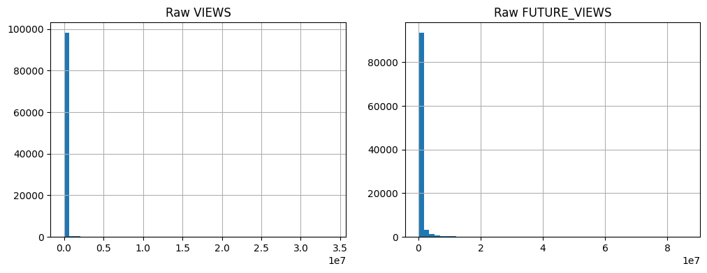
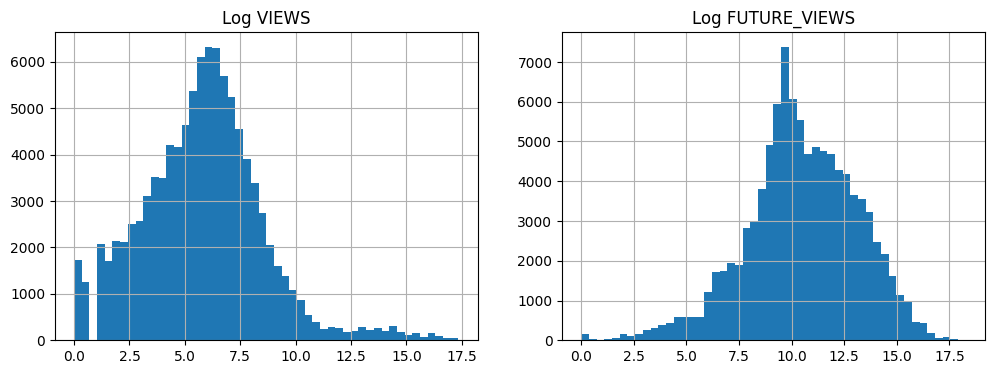
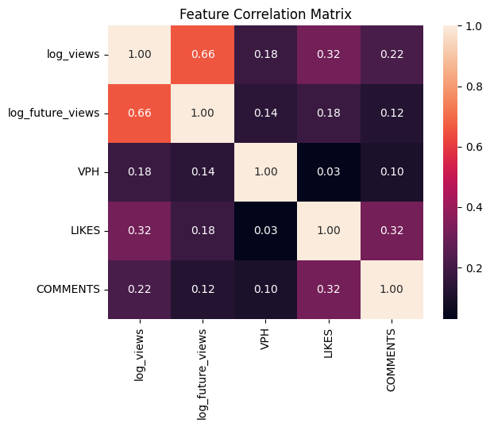
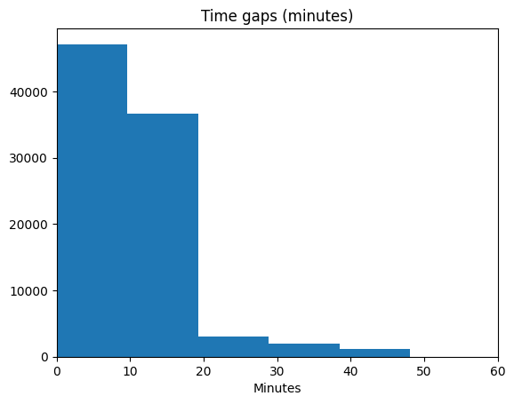
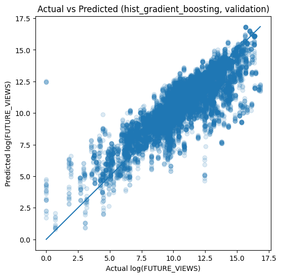
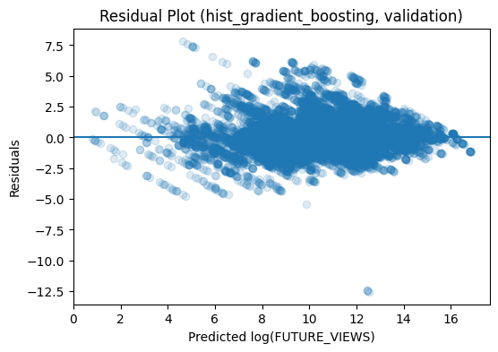
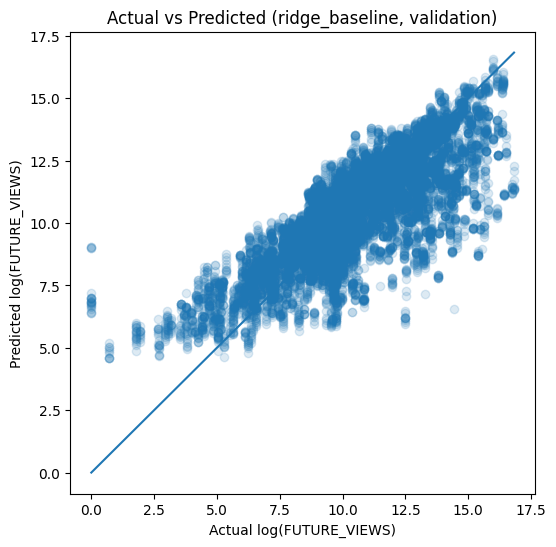
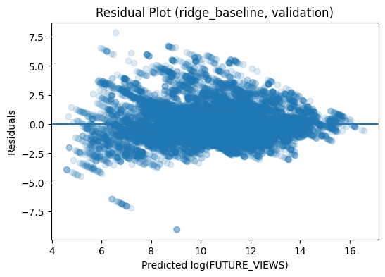
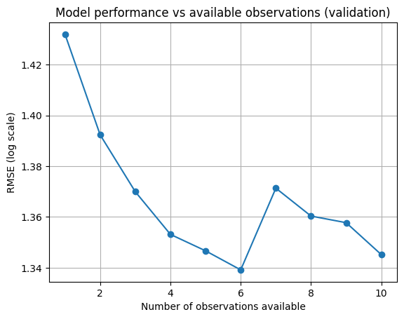
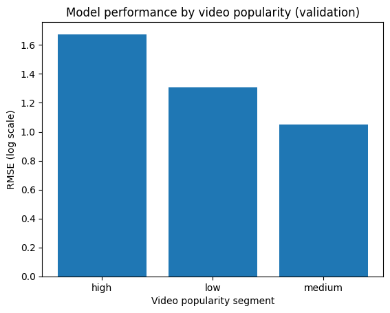

# Predicting Future Video Views from Temporal Panel Data

## 1. Executive Summary

This project addresses the task of predicting the number of views a video will receive at a specific future point in time, using repeated observations collected during its lifetime. The core challenge is not only predictive accuracy, but also flexibility: the model should be able to make a prediction after one observation, then refine that prediction as more observations become available.

I approached the problem as a **prefix-based supervised learning task on panel data**. Each row in the dataset is treated as a valid prediction instance, representing the state of a video after a given number of scrapes. This gives a practical way to support varying numbers of observations without requiring a more complex sequence model.

The final pipeline is fully reproducible and includes:
- data cleaning and feature engineering,
- grouped train/validation/test splitting by `VIDEO_ID`,
- training of a baseline linear model and a stronger nonlinear model,
- model selection on validation only,
- final reporting on a held-out test set,
- additional analysis showing whether performance improves as more observations become available.

Among the two models evaluated, **Histogram Gradient Boosting** was selected as the final model. It achieved a validation RMSE of **1.367** on the log scale, compared with **1.579** for the ridge baseline. On the held-out test set, the selected model achieved an RMSE of **1.331**, again outperforming the baseline. Importantly, the model also shows an overall improvement as more observations become available: validation RMSE decreases from **1.432** at the first observation to **1.345** at the tenth.

The guiding principle throughout this work was to prioritise a **clean, working, end-to-end pipeline** over a more complicated modelling approach that might or might not improve performance. Given the scope of the assessment, I considered that the strongest submission was one that was correct, reproducible, and methodologically sound.

---

## 2. Problem Definition

Let \( i \in \{1, \dots, N\} \) index videos, and let \( t \in \{0, 1, \dots, T_i-1\} \) index the observation number for video \( i \), ordered by scrape time. For each video and scrape index, we observe a feature vector

\[
x_{i,t} \in \mathbb{R}^p,
\]

containing information such as current views, likes, comments, views per hour, channel subscribers, and timing information.

The prediction target is the future number of views at a specified future time point. I denote this target by

\[
y_{i,t},
\]

although exploratory analysis suggests that, within a given video, this target is approximately constant across prefixes, indicating that the task is effectively a **fixed-horizon future prediction problem** rather than a rolling next-step forecast.

Because the raw target is highly skewed, the model is trained on the transformed quantity

\[
z_{i,t} = \log(1 + y_{i,t}).
\]

The modelling objective is therefore to learn a function

\[
f: x_{i,t} \mapsto z_{i,t},
\]

such that predictions improve as \( t \) increases, that is, as the model is given richer partial information about the same video.

### Practical interpretation

The key modelling decision is to treat each row as a **prefix snapshot** of the video trajectory:
- at \( t = 0 \), the model sees only the earliest available state;
- at \( t = 1 \), it sees a slightly richer state;
- and so on.

This formulation makes the pipeline naturally compatible with varying numbers of observations. In other words, the flexibility requested in the brief is achieved by design: the same trained model can score a video after any number of observed prefixes, provided the corresponding features are available.

---

## 3. Data Understanding and Engineering Rules

### 3.1 Panel structure

The dataset has a clear longitudinal structure:
- each `VIDEO_ID` appears multiple times,
- most videos have 10 observations,
- observations within each video are ordered by `SCRAPE_TIME`.

This matters because the unit of independence is **the video**, not the row. Any data split that mixes prefixes of the same video across train and validation would create leakage.

### 3.2 Assumptions used in the pipeline

I made the following assumptions explicitly and consistently throughout the pipeline:

1. **Each row is a valid partial-information training example.**  
   A row does not represent a separate video; it represents a partial state of the same video trajectory.

2. **The target is effectively fixed-horizon within video.**  
   Since `FUTURE_VIEWS` is approximately constant across observations of the same video, I treated the task as repeated prediction of the same future endpoint from increasingly informative prefixes.

3. **Videos, not rows, must be split across train/validation/test.**  
   This is the main anti-leakage rule.

4. **Irregular scrape intervals are informative.**  
   The model should not assume equally spaced observations, so elapsed-time features were engineered explicitly.

5. **Clearly inconsistent videos should be removed at video level, not row level.**  
   If one observation indicates serious corruption, dropping only that row would leave an internally inconsistent trajectory for the same video.

### 3.3 Data-cleaning rules

The most important engineering rules were the following.

**Rule 1: sort by video and scrape time.**  
All observations were sorted by `VIDEO_ID` and `SCRAPE_TIME` before feature engineering.

**Rule 2: create a within-video time index.**  
A variable `TIME_IDX` was created using the cumulative row order within each video.

**Rule 3: remove corrupted videos.**  
If a row had `VIDEO_DURATION = 0` and at least one positive engagement quantity among
`VPH`, `LIKES`, `VIEWS`, `COMMENTS`, or `FUTURE_VIEWS`, the **entire video** was removed.

This is a conservative rule, but it is easy to justify. A zero-duration video with positive engagement is logically inconsistent, and because the same video appears multiple times, partial deletion would leave a broken panel trajectory behind.

**Rule 4: keep low-engagement and zero-target rows unless they are clearly corrupted.**  
Rows with `FUTURE_VIEWS = 0` were retained, as these can plausibly represent genuinely low-performing videos.

**Rule 5: exclude high-cardinality text fields from the baseline pipeline.**  
`TITLE` and `DESCRIPTION` were dropped from modelling. This was not because they are necessarily useless, but because the goal here was to build a robust baseline-to-production-style tabular pipeline quickly, not a text-enhanced multimodal system.

### 3.4 Feature engineering

The following engineered features were used in the baseline modelling dataset:

- `log_video_duration`
- `log_vph`
- `log_likes`
- `log_views`
- `log_comments`
- `log_channel_subscribers`
- `TIME_IDX`
- `time_since_prev_scrape_min`
- `time_since_first_scrape_min`
- `video_age_at_scrape_min`

The log-transformed variables were defined using

\[
\tilde{x} = \log(1 + x),
\]

which is appropriate here because the engagement variables are non-negative and highly right-skewed.

### 3.5 Why these engineering choices make sense

The feature set balances three goals:
- capture the current popularity state of the video,
- capture where the video is in its observed trajectory,
- preserve a simple tabular representation that works with standard regressors.

This is a deliberately pragmatic design. It does not attempt to reconstruct the full sequence dynamics explicitly; instead, it provides the model with enough information to learn how predictions should change as additional observations arrive.

---

## 4. Exploratory Findings

The exploratory analysis shaped the modelling choices in a direct way.

### 4.1 Raw and transformed distributions

The raw `VIEWS` and `FUTURE_VIEWS` distributions are extremely right-skewed:

After applying `log(1+x)`, the distributions become far more regular and suitable for regression:

This motivated both the log-transformation of key input variables and the use of a log-transformed target.

### 4.2 Correlation structure

The correlation matrix shows that `log_views` has the strongest single linear relationship with the target, while other engagement variables contribute additional but weaker signal:

This suggested two things:
- a linear baseline is worth including,
- but nonlinear effects and interactions are likely to matter.

### 4.3 Irregular observation timing

The time gaps between observations are not uniform:

This ruled out any assumption of equally spaced sampling and justified the inclusion of elapsed-time features.

---

## 5. Modelling Strategy

### 5.1 Train/validation/test protocol

The dataset was split by `VIDEO_ID` using grouped random splits:
- **70% train**
- **15% validation**
- **15% test**

This means that no video appears in more than one split. The validation set was used for model comparison and selection; the test set was used only once for final reporting.

This choice is essential. Since multiple rows correspond to the same video, row-wise splitting would artificially inflate performance by allowing the model to see partial trajectories of the same video during training and evaluation.

### 5.2 Models considered

Two models were trained.

#### Ridge regression

The ridge baseline solves

$$
\hat\beta = \arg\min_\beta \sum_{(i,t)\in D_{\rm train}} (z_{i,t} - x_{i,t}^T \beta)^2 + \lambda \|\beta\|_2^2
$$

This provides:
- a transparent linear benchmark,
- a useful reference point for whether nonlinear modelling is actually needed.

#### Histogram Gradient Boosting

The main model was `HistGradientBoostingRegressor`, which builds an additive ensemble of trees:

\[
\hat{f}(x) = \sum_{m=1}^{M} \eta \, h_m(x),
\]

where each \( h_m \) is a regression tree fit to reduce the residual error from the previous stage, and \( \eta \) is the learning rate.

I chose this model because it is well suited to structured tabular data, captures nonlinear effects and interactions naturally, and is available in scikit-learn without adding extra infrastructure.

### 5.3 Why I did not use a more complicated model

A more complex architecture, such as LightGBM, XGBoost, an RNN, or a Transformer, may improve results. However, that was not the priority for this submission.

My priority was to produce:
- a clean and reproducible pipeline,
- a model that genuinely handles varying numbers of observations,
- an evaluation protocol with correct leakage control,
- a result that is easy to inspect and defend.

Given the assessment context, I considered that a working pipeline with sensible choices was more valuable than a more ambitious but less robust solution.

---

## 6. Results

## 6.1 Validation model comparison

The validation results are shown below.

| Model | RMSE (log) | MAE (log) | R² (log) | RMSE (original) | MAE (original) | R² (original) |
|---|---:|---:|---:|---:|---:|---:|
| HistGradientBoosting | 1.367 | 0.970 | 0.599 | 699,051 | 335,909 | 0.281 |
| Ridge baseline | 1.579 | 1.171 | 0.467 | 722,480 | 366,320 | 0.234 |

The nonlinear model improves RMSE on the primary log scale by roughly **13.4%** relative to the ridge baseline:

\[
\frac{1.579 - 1.367}{1.579} \approx 13.4\%.
\]

This is a meaningful gain and supports the conclusion that the problem contains nonlinear structure that the linear baseline cannot fully capture.

### 6.2 Diagnostic plots

The selected model tracks the broad signal well:

Residuals remain centred around zero overall, but the spread is larger for some prediction ranges and especially for harder cases:

For comparison, the ridge baseline shows a visibly more constrained fit:

The qualitative picture matches the numerical comparison: the linear model captures the main trend but leaves more systematic error unmodelled.

### 6.3 Final held-out test results

After selecting the model on validation only, both candidates were evaluated on the held-out test set for transparency.

| Model | RMSE (log) | MAE (log) | R² (log) | RMSE (original) | MAE (original) | R² (original) |
|---|---:|---:|---:|---:|---:|---:|
| HistGradientBoosting | 1.331 | 0.939 | 0.616 | 1,168,945 | 451,692 | 0.186 |
| Ridge baseline | 1.520 | 1.110 | 0.500 | 1,210,647 | 495,154 | 0.111 |

The final selected model again outperforms the baseline. The log-scale RMSE improves by about **12.4%** on the test set:

\[
\frac{1.520 - 1.331}{1.520} \approx 12.4\%.
\]

This consistency between validation and test is encouraging. It suggests that the selected model generalises better rather than simply fitting validation specific patterns.

---

## 7. Does the Model Improve as More Observations Become Available?

This is one of the central requirements of the assessment, so I evaluated it explicitly.

For each exact prefix length, I computed validation RMSE on the selected model.

| Number of observations | RMSE (log) | MAE (log) |
|---|---:|---:|
| 1 | 1.432 | 1.052 |
| 2 | 1.392 | 1.019 |
| 3 | 1.370 | 0.997 |
| 4 | 1.353 | 0.979 |
| 5 | 1.347 | 0.972 |
| 6 | 1.339 | 0.968 |
| 7 | 1.371 | 0.967 |
| 8 | 1.360 | 0.959 |
| 9 | 1.358 | 0.963 |
| 10 | 1.345 | 0.955 |

The pattern is not perfectly monotone, but the overall trend is clear: performance improves as more observations become available. From the first to the tenth observation, RMSE decreases from **1.432** to **1.345**, which is an overall reduction of about **6.1%**.

This is an important result, because it shows that the model is not merely predicting future views from a static feature snapshot. It is using the progressively richer temporal information encoded in later prefixes.

---

## 8. Performance by Popularity Segment

To better understand where the model works well and where it struggles, I also evaluated performance across quantile-based validation segments of the target.

| Segment | Number of rows | RMSE (log) | MAE (log) |
|---|---:|---:|---:|
| Low | 4,886 | 1.305 | 0.990 |
| Medium | 4,888 | 1.049 | 0.811 |
| High | 4,876 | 1.675 | 1.148 |

The pattern is intuitive:
- **medium-popularity videos** are the easiest to predict,
- **high-popularity videos** are the hardest,
- **low-popularity videos** are more difficult than medium ones, but much less difficult than the highest segment.

This suggests that the heaviest tail of the distribution remains challenging even after log-transformation. In practical terms, videos that become very large are likely driven by additional factors not captured in the current feature set.

---

## 9. Repository and Pipeline Deliverables

The repository was organised as a working project rather than a notebook-only submission. It includes:
- raw and processed data folders,
- modular source code for preprocessing, splitting, feature engineering, training, and evaluation,
- saved models,
- generated tables and figures,
- a top-level pipeline script.

The pipeline can be run end to end from a single entry point and produces the processed dataset, trained models, evaluation tables, and diagnostic figures. This was an intentional design choice. For a real data science workflow, a reproducible pipeline is often more valuable than a stronger but less maintainable prototype.

---

## 10. Limitations and Future Work

This solution is intentionally practical rather than exhaustive. There are several directions in which it should be extended if the project continues.

### 10.1 Hyperparameter tuning

I did **not** perform systematic hyperparameter optimisation in this submission. That was a deliberate trade-off: I prioritised delivering a correct and complete pipeline quickly.

If the project were continued, this would be the first improvement to implement. The correct way to do it here would be **group-aware cross-validation**, so that all rows from the same `VIDEO_ID` remain in the same fold. In practice, I would use something like:
- `GroupKFold` or repeated grouped validation splits,
- a search procedure such as grid search, random search, or Bayesian optimisation,
- optimisation against validation RMSE on the log scale.

For ridge regression, this would mainly involve tuning the regularisation parameter \( \lambda \). For gradient boosting, it would involve parameters such as:
- learning rate,
- tree depth,
- number of boosting iterations,
- minimum leaf size,
- regularisation-related controls.

The reason this matters is simple: the current results are based on reasonable manual settings, not on a tuned optimum. That means there is likely still performance available within the current modelling family.

### 10.2 Stronger or more specialised models

The current models are off-the-shelf tabular regressors. They provide a strong starting point, but they do not exhaust the modelling possibilities.

Promising next candidates would include:
- LightGBM or XGBoost,
- CatBoost,
- neural tabular models,
- explicit sequence models such as RNNs or Transformers.

I did not use these here because they increase implementation complexity, tuning burden, and debugging time. Still, they remain natural next steps if the objective shifts from “deliver a robust pipeline quickly” to “push predictive performance as far as possible”.

### 10.3 Richer feature engineering

The current feature set is intentionally compact. There is room for additional signal engineering, for example:
- growth rates between consecutive scrapes,
- ratios such as likes-per-view or comments-per-view,
- acceleration-style features based on changes in `VPH`,
- channel-level historical priors,
- text-derived embeddings from titles or descriptions.

These features may be especially useful for the hardest part of the target distribution, namely the most popular videos.

### 10.4 Functional regression and a more interpretable temporal model

A more statistically structured extension would be to move from a prefix-tabular view to a **functional regression** view.

The idea would be to treat the observed trajectory of a video, for example its view-count curve over time, as a partially observed function

\[
X_i(s), \quad s \in \mathcal{T},
\]

and model a scalar future outcome \( Y_i \) through a scalar-on-function regression model such as

\[
Y_i = \alpha + \int_{\mathcal{T}} X_i(s)\beta(s)\, ds + \varepsilon_i.
\]

This would be attractive for two reasons:
1. it uses the temporal trajectory more directly than the current engineered-feature approach;
2. it can be more interpretable, because the coefficient function \( \beta(s) \) indicates which parts of the trajectory are most predictive of future views.

In Python, this could be explored using **scikit-fda**, which provides tooling for functional data representation, preprocessing, exploratory analysis, regression, and related FDA workflows. The documentation includes tutorials, examples, and API reference for this ecosystem. For a continuation of this project, one could:
- reconstruct each video’s observed trajectory on a common time grid,
- smooth or represent the trajectory using basis functions,
- fit a scalar-on-function linear model,
- compare its interpretability and performance against the current tabular approach.

I would not expect this to be the fastest production route, but it could become a very interesting direction if interpretability and principled temporal modelling become as important as raw predictive accuracy.

---

## 11. Conclusion

This project delivers a complete and reproducible machine learning pipeline for predicting future video views from temporal panel data.

The main contribution is the modelling formulation: instead of building a complex sequence architecture immediately, I represented the task as **prefix-based regression on grouped panel data**. This allows the same model to handle varying numbers of observations naturally, while preserving a simple and robust implementation.

Within that framework:
- the data was cleaned using explicit and defensible rules,
- leakage was controlled by splitting at the video level,
- a nonlinear boosting model clearly outperformed a linear baseline,
- and performance improved overall as more observations became available.

I consider this a strong first version of the solution: technically sound, reproducible, and aligned with the requirements of the assessment. At the same time, it leaves clear room for further work, especially in hyperparameter tuning, richer features, stronger models, and more structured temporal approaches such as functional regression.